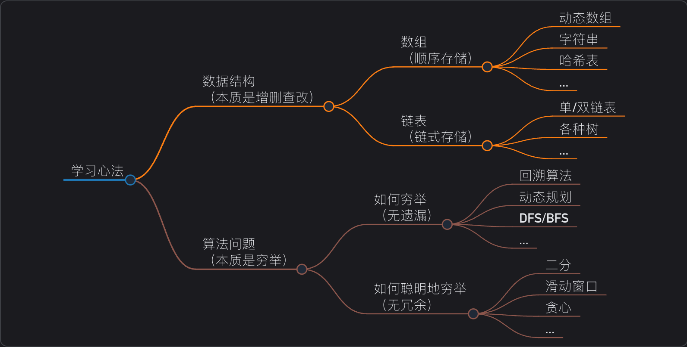

# 学习数据结构和算法的框架思维
[Original Link](https://labuladong.online/zh/algo/essential-technique/algorithm-summary/)

## 总结一切数据结构和算法

种种数据结构，皆是**数组**（顺序存储）和**链表**（链式存储）的变换。
数据结构的关键点在于**遍历和访问**，即增删改查等基本操作。
种种算法，皆是**穷举**。
穷举的关键点在于**无遗漏和无冗余**。熟练的掌握算法框架，可以做到无遗漏；充分利用信息，可以做到无冗余。

## 数据结构的存储方式

**数据结构的存储方式只有两种：数组（顺序存储）和链表（链式存储）**。

这句话怎么理解，不是还有哈希表、栈、队列、堆、树、图等等各种数据结构吗？

分析问题，一定要有递归的思想，自顶而下，从抽象到具体。上述那些皆属于上层建筑，而数组和链表才是结构基础。因为那些多样化的数据结构，究其源头，都是在链表或者数组上的特殊操作，API 不同而已。

比如说队列、栈这两种数据结构既可以使用链表也可以使用数组实现。用数组实现，就要处理扩容缩容的问题；用链表实现，没有这个问题，但需要更多的内存空间存储节点指针。

图结构的两种存储方式，连接表就是链表，邻接矩阵就是二维数组。链接矩阵连通性迅速，并可以进行矩阵运算解决一些问题，但是如果图比较稀疏的话会很耗费空间。邻接表比较节省时间，但是很多操作的效率上肯定比不上邻接矩阵。

哈希表就是通过散列函数把键映射到一个大数组中。对于解决散列冲突的方法，拉链法需要链表特性，操作简单，但是需要额外的空间存储指针；线性探查法需要数组特性，以便连续寻址，不需要额外的空间，但操作稍微复杂点。

树结构，用数组实现就是堆，因为堆是一个完全二叉树，用数组存储不需要节点指针，操作也比较简单，经典应用有二叉堆；用链表实现就是很常见的那种树，因为不一定是完全二叉树，所以不适用用数组存储。为此，这种链表树结构之上，有衍生出各种巧妙的设计，比如二叉搜索树、AVL 树、红黑树、区间树、B 树等等，以应对不同的问题。

综上，数据结构种类很多，甚至你可以发明自己的数据结构，但是底层存储无非数组或者链表，二者的优缺点如下：

数组由于紧凑连续存储，可以随机访问，通过索引快速找到对应元素，而且相对解决存储空间。但正因为连续存储，内存空间必须一次性分配够，所以数组如果要扩容，需要重新分配一块更大的空间，在把数据全部复制过去，时间复杂度$O(N)$；而且你如果在数组中间插入和删除，每次必须搬运后面的所有数据以保存连续，时间复杂度$O(N)$。

链表因为元素不连续，而是依靠指针指向下一个元素的位置，所以不存在数据的扩容问题；如果知道某一元素的前驱和后驱，操作指针即可删除该元素或者插入新元素，时间复杂度$O(1)$。但是正因为存储空间不连续，你无法根据一个索引算出对应元素的地址，所以不能随机访问；而且对于每个元素必须存储指向前后元素位置的指针，会消耗相对更多的存储空间。

## 数据结构的基本操作

**对于任何数据结构，其基本操作无非遍历+访问，再具体一点就是：增删改查**。

对于数据结构种类很多，但他们存在的目的都是在不同的应用场景，尽可量高效地增删改查，这就是数据结构的使命。

如何遍历+访问？我们仍从最高层来看，各种数据结构的遍历+访问无非两种形式：线性的和非线性的。

线性就是 `for/while` 迭代为代表，非线性就是递归为代表。

## 算法的本质

**算法的本质就是穷举**。

## 穷举的难点

你千万不要觉得穷举这个事儿很简单，穷举有两个关键难点：**无遗漏、无冗余**。

遗漏，会直接导致答案出错，比如让你求最小值，你穷举时恰好把那个最小值漏掉了，这不就错了嘛。

冗余，会拖慢算法的运行速度，比如你的代码把完全相同的计算流程重复了十遍，那你的算法不就慢了十倍么，就有可能超过判题平台的时间限制。

为什么会遗漏？因为你对算法框架掌握不到位，不知道正确的穷举代码。

为什么会冗余？因为你没有充分利用信息。

所以，当你看到一道算法题，可以从这两个维度去思考：

1、如何穷举？即无遗漏地穷举所有可能解。

2、如何聪明地穷举？即避免穷举过程中的冗余计算，消耗尽可能少的资源求出答案。

### 如何穷举

**什么算法的难点在如何穷举呢？一般是递归问题，比如说回溯算法、动态规划算法**。

